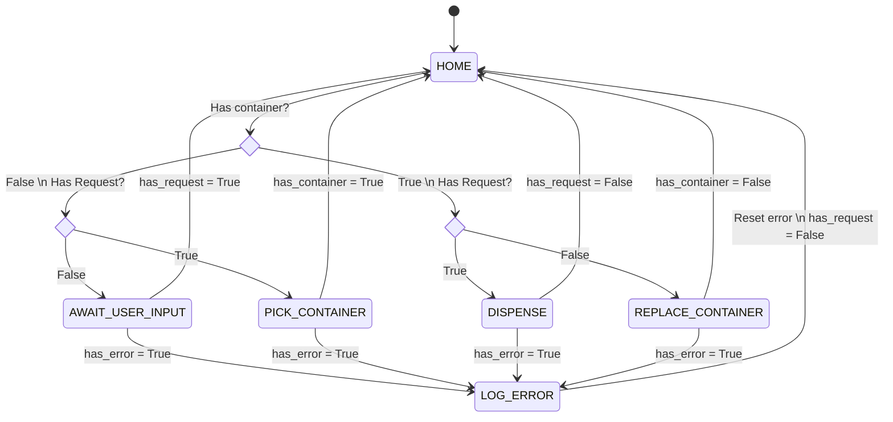
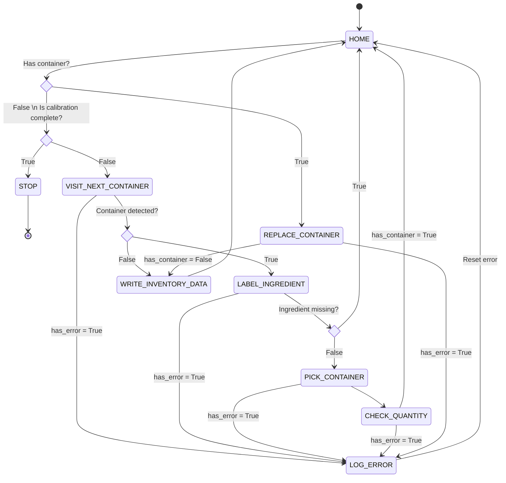
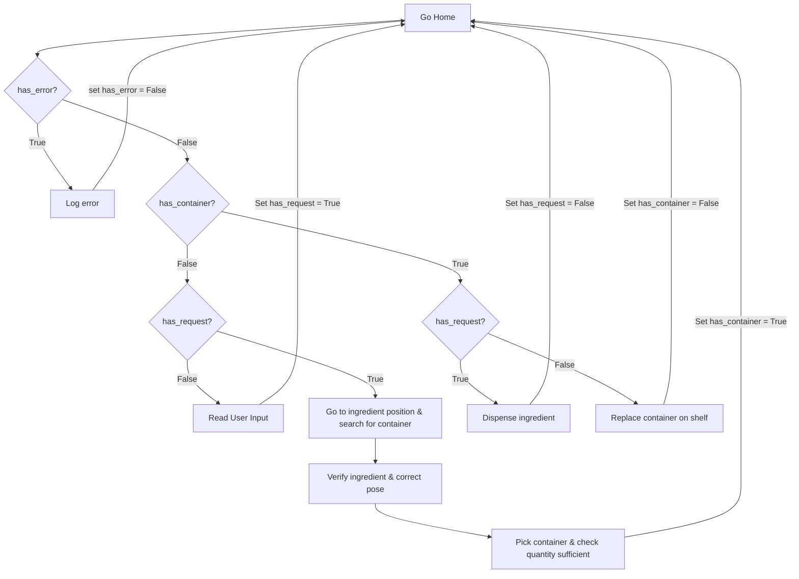

# ratatouille_planner

ROS package that handles high-level planning for the Ratatouille ingredient dispensing system.

## Dispense Flow State Diagram



## Calibration Flow State Diagram



## Flowchart


## Dependencies

- catkin
- roscpp
- rospy
- std_msgs
- ur_motion
- ratatouille_pose_estimation
- dispense
- sensor_interface
- ur5e_moveit_config
- realsense2_camera
- ar_track_alvar
- robotiq_urcap_control

## Usage

### Inventory update
Pre-requisite services:
``` sh
roslaunch ur_motion ur5e_bringup.launch robot_ip:=10.0.0.2

roslaunch ratatouille_planner ratatouille-bringup.launch
```
Usage:
``` sh
rosrun ratatouille_planner calibrate_autonomous.py [-h] [--debug] [--config-dir CONFIG_DIR] [--disable-gripper] [--disable-external-input] [--bypass-picking]
                               [--bypass-id-service] [--bypass-sensing] [--verbose] [--stop-and-proceed]

optional arguments:
  -h, --help            show this help message and exit
  --debug               Enable debug mode (run without robot)
  --config-dir CONFIG_DIR
                        Directory path for configuration files
  --disable-gripper     Disable gripper commands
  --disable-external-input
                        Disable user input board
  --bypass-picking      Bypass container picking
  --bypass-id-service   Bypass ingredient identification
  --bypass-sensing      Bypass sensing
  --verbose             Enable verbose output
  --stop-and-proceed    Announce and wait for key-press before performing each action
```

### Dispensing
Pre-requisite services:
``` sh
roslaunch ur_motion ur5e_bringup_ratatouille.launch robot_ip:=10.0.0.2

roslaunch ratatouille_planner ratatouille-bringup.launch calibrate:=false
```
Usage:
``` sh

rosrun ratatouille_planner dispense_autonomous.py [-h] [--debug] [--config-dir CONFIG_DIR] [--dispense-log-file DISPENSE_LOG_FILE]
                              [--ingredient-quantity-log INGREDIENT_QUANTITY_LOG] [--disable-gripper] [--disable-external-input] [--bypass-dispensing]
                              [--verbose] [--stop-and-proceed]

optional arguments:
  -h, --help            show this help message and exit
  --debug               Enable debug mode (run without robot)
  --config-dir CONFIG_DIR
                        Directory path for configuration files
  --dispense-log-file DISPENSE_LOG_FILE
                        Dispensing log file path
  --ingredient-quantity-log INGREDIENT_QUANTITY_LOG
                        Ingredient quantity log file path
  --disable-gripper     Disable gripper commands
  --disable-external-input
                        Disable user input board
  --bypass-dispensing   Bypass dispensing
  --verbose             Enable verbose output
  --stop-and-proceed    Announce and wait for key-press before performing each action

```
