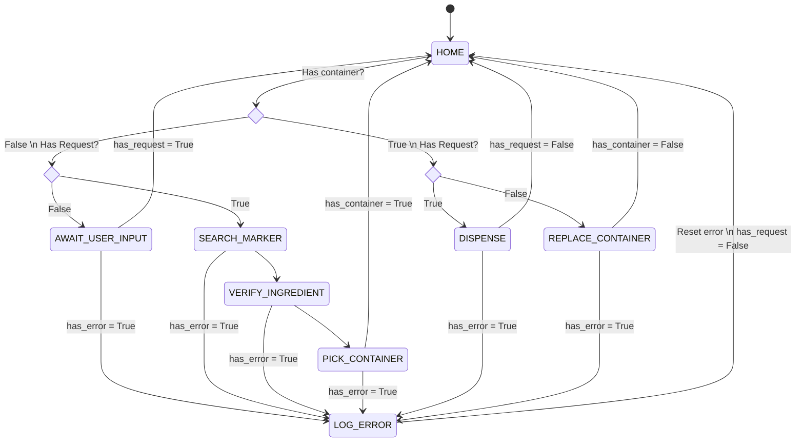
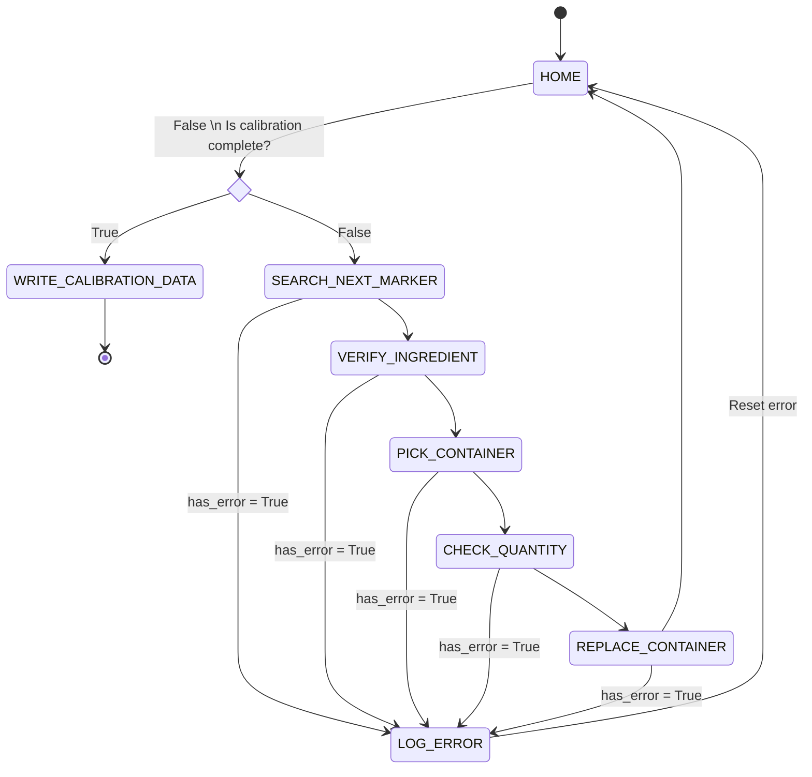
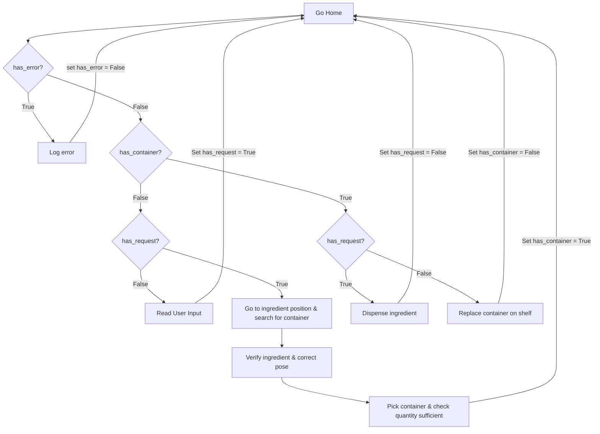

# ratatouille_planner

ROS package that handles high-level planning for the Ratatouille ingredient dispensing system.

## Dispense Flow State Diagram



## Calibration Flow State Diagram



## Flowchart


## Dependencies

- catkin
- roscpp
- rospy
- std_msgs
- ur_motion
- ratatouille_pose_estimation
- dispense
- sensor_interface
- ur5e_moveit_config
- realsense2_camera
- ar_track_alvar
- robotiq_urcap_control

## Usage

```
roslaunch ratatouille_planner dispense_autonomous.py [-h] [--debug] [--config-dir CONFIG_DIR] [--disable-gripper]
                            [--disable-external-input] [--verbose] [--stop-and-proceed]

optional arguments:
  -h, --help            show this help message and exit
  --debug               Enable debug mode (run without robot)
  --config-dir CONFIG_DIR
                        Directory path for configuration files
  --disable-gripper     Disable gripper commands
  --disable-external-input
                        Disable user input board
  --verbose             Enable verbose output
  --stop-and-proceed    Announce and wait for key-press before performing each action

```
