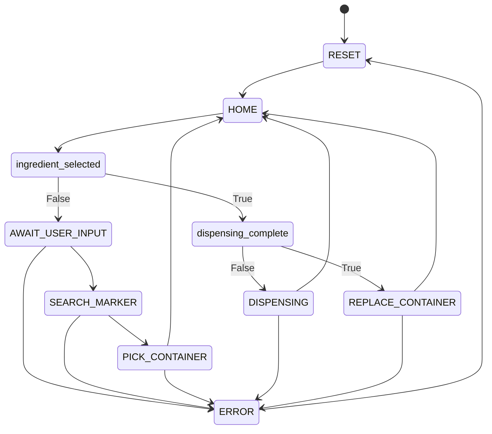

# ratatouille_planner

ROS package that handles high-level planning for the Ratatouille ingredient dispensing system.

## State Diagram

```mermaid
stateDiagram-v2
    [*] --> RESET
    RESET --> HOME
    HOME --> ingredient_selected
    ingredient_selected --> AWAIT_USER_INPUT: False
    ingredient_selected --> dispensing_complete: True
    dispensing_complete --> DISPENSING: False
    dispensing_complete --> REPLACE_CONTAINER: True
    AWAIT_USER_INPUT --> SEARCH_MARKER
    SEARCH_MARKER --> PICK_CONTAINER
    PICK_CONTAINER --> HOME
    DISPENSING --> HOME
    REPLACE_CONTAINER --> HOME

    AWAIT_USER_INPUT --> ERROR
    SEARCH_MARKER --> ERROR
    PICK_CONTAINER --> ERROR
    DISPENSING --> ERROR
    REPLACE_CONTAINER --> ERROR
    ERROR --> RESET

```

## Dependencies
[TODO]

## Usage
[TODO]
